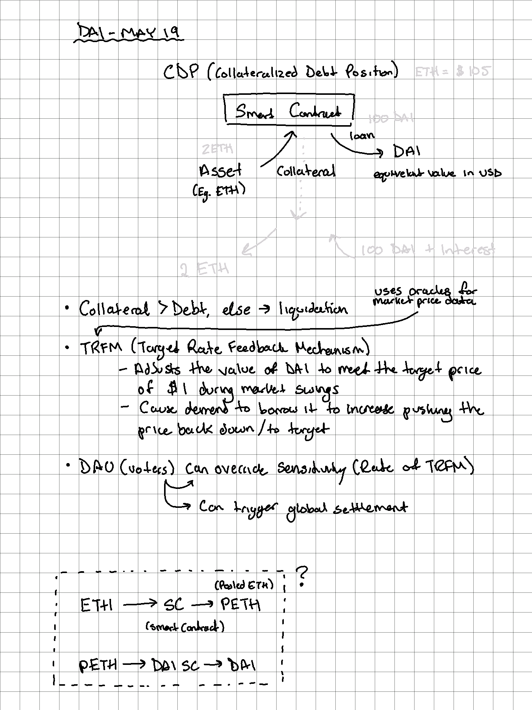

---
---

## Features

- Stablecoin, closely pegged to US Dollar
- Can delegate control and authorise certain apps, such as Oasis, to spend Dai on your behalf
- Backed by assets worth more than the Dai (like how traditional money used to be backed by gold)

## Resources

- [What is DAI, and how does it work?](https://medium.com/mycrypto/what-is-dai-and-how-does-it-work-742d09ba25d6)

## Overview

