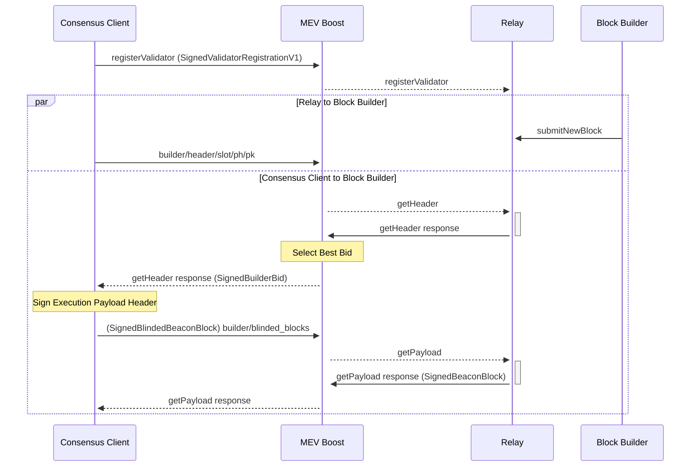

Discussion on MEV for Eth2, focusing on software stack inc. [[mev-boost]], mev-relay, consensus client, etc.
## Overview

### Sequence Diagram



```
SignedValidatorRegistrationV1
    ValidatorRegistrationV1
	    fee_recipient
	    gas_limit
	    timestamp
	    pubkey
    signature
    
SignedBuilderBid
    BuilderBid
        header
	    value
	    pubkey
    signature

class SignedBlindedBeaconBlock(Container):
    BlindedBeaconBlock
	    slot
	    proposer_index
	    parent_root
	    state_root
	    BlindedBeaconBlockBody
			...
		    eth1_data: Eth1Data
		    execution_payload_header
    signature
```


### Signing
...

### Commitment
_TODO: What prevents the validator, after receiving the full block contents from modifying the transaction order that came from the builder? 
1. "Validators receive the full block after they sent the signed blinded beacon block. Once that is done, they cannot propose any other block, otherwise they can and will get slashed." - Discord
2. Wouldn't it be advantageous for the design to have the relay (which is already a point of trust) to broadcast the block since it already got the blind signature for the block? With this setup, the validator never actually sees the block contents. - Thinking out loud...

### Fee Recipient
Steps:
1. Block builder calls beacon client, asking for proposer for next slot which contains the fee recipient ([source](https://github.com/flashbots/boost-geth-builder/pull/18/files#diff-a59d896190c8d48e0e14a20253edf6317abbad5a6cb7ae401a3e54e660210a65R172-R186))
2. Block builder sends bid to the Relay (mev-relay service)
3. Relay forwards payload to the [Block validation API service](https://github.com/flashbots/block-validation-geth) which simulates the block and ensures the fee recipient has been paid the amount stated in the `payload.value` field

[Ongoing discussion](https://boost.flashbots.net/mev-boost-status-updates/builder-payments-to-block-proposers) about an "industry standard" way of doing payouts. For launch Flashbots is proceeding with proposer payment with a transaction from the builder at the end of the block. [Relevant GH issue discussion](https://github.com/flashbots/mev-boost/issues/220)

## Wiki
### Background Reading
* [Original Architecture Proposal for MEV Boost by Flashbots](https://ethresear.ch/t/mev-boost-merge-ready-flashbots-architecture/11177)
* ["Unofficial" design proposal for MEV boost](https://hackmd.io/@paulhauner/H1XifIQ_t) - good chunk made it into official implementation; provides backgound
* [Beginners Guide to MEV Boost](https://writings.flashbots.net/writings/beginners-guide-mevboost)
* [MEV-Boost Quickstart](https://boost.flashbots.net/#block-356364ebd7cc424fb524428ed0134b21)

### Implementation Resources
* [Builder Spec Schema](https://github.com/ethereum/builder-specs/blob/main/specs/builder.md#validatorregistrationv1) and [Builder Spec API](https://ethereum.github.io/builder-specs/#/Builder/getHeader) - how Consensus Client (e.g. Prysm) communicates with MEV Boost
* [Psuedo-code to construct `BeaconBlockBody`](https://github.com/ethereum/consensus-specs/blob/dev/specs/bellatrix/validator.md#constructing-the-beaconblockbody)
* [Relay Spec API](https://flashbots.notion.site/Relay-API-Spec-5fb0819366954962bc02e81cb33840f5) - from Flashbots, bit confusing of a document
* Source Code
	* [Sample block builder implementation built on Geth](https://github.com/flashbots/boost-geth-builder)
	* [Sample relay implementation](https://github.com/flashbots/mev-boost-relay)
	* [Tool to mock execution engine and consensus client for testing](https://github.com/protolambda/mergemock)
	* [Go schemas for all specs](https://github.com/flashbots/go-boost-utils/blob/068dec572e8d7b761c75831f16b7fd73109551b1/types/builder.go#L162)

### Builder Spec Support
| Project | Status |
|---------|--------|
| [Teku](https://github.com/ConsenSys/teku) - Java | Supported ([#156](https://github.com/flashbots/mev-boost/issues/156)) |
| [Prysm](https://github.com/prysmaticlabs/prysm/) - Go | Supported ([#158](https://github.com/flashbots/mev-boost/issues/158)) |
| [Lighthouse](https://github.com/sigp/lighthouse) - Rust | Supported ([#160](https://github.com/flashbots/mev-boost/issues/160)) |
| [Lodestar](https://github.com/ChainSafe/lodestar) - TypeScript | Supported ([#157](https://github.com/flashbots/mev-boost/issues/157)) |
| [Nimbus](https://github.com/status-im/nimbus-eth2/) - Nim | Supported ([#159](https://github.com/flashbots/mev-boost/issues/159)) |