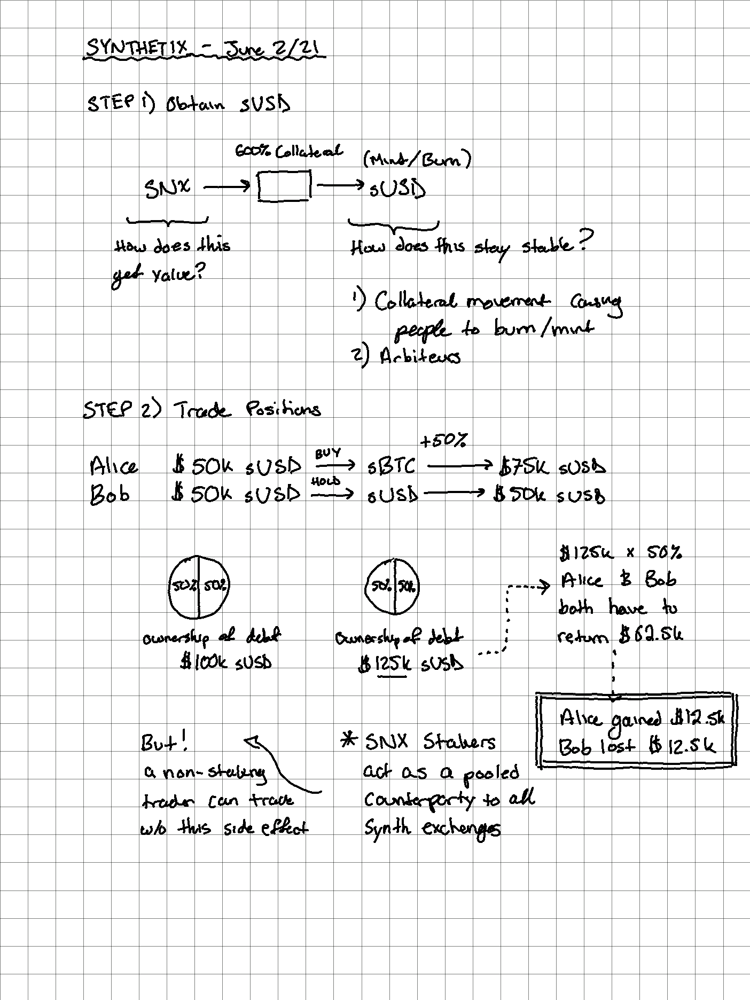

---
---

## Introduction

**Resources**

- [Litepaper](https://docs.synthetix.io/litepaper)
- [Gemini - What Is Synthetix and How Does It Work?](https://www.gemini.com/cryptopedia/synthetix)

**How it Works**

1. Put SNX token into a liquidity pool and mint out sUSD (stable coin, e.g. like [[dai]])
2. Use your sUSD to buy and sell synth tokens which follow the price of the chainlink oracles
3. The total outstanding value in the system is considered debt and you as a SNX staker have to cover that debt So of all assets goes up (e.g. 1B --> 1.2B) the % ownership you had now requires you to pay off the debt accordingly. So if you bought in at 0.1% with $1M sUSD worth of SNX, now you need to go find $200k sUSD to cover the rest of the debt or you'll eventually get liquidated.

However, non-stakers can freely buy/sell and don't carry this counter-party risk.



```
# Method 1: Exchange (kwenta.io)
ETH --> sUSD (exchange) --> sXXX (exchange)

# Method 2: Stake
Get SNX on an exchange --> staking.synthetix.io (stake) --> sUSD (mint) --> sXXX (exchange)
```

**Examples**

- See [examples 1 and 2](https://docs.synthetix.io/litepaper)

**Example: total debt goes below collateral**

| Step             | Alice                                                                                            | Bob                       | Total Debt |
| ---------------- | ------------------------------------------------------------------------------------------------ | ------------------------- | ---------- |
| ...              | 350 SNX --> 50k sUSD                                                                             | 350 SNX --> 50k sUSD      | 100k sUSD  |
| ...              | 50k sUSD --> 1 sBTC                                                                              | Holds 50k sUSD            | ...        |
| sBTC 50k --> 10k | 30k sUSD debt owed                                                                               | 30k sUSD debt owed        | 60k sUSD   |
| ...              | 10k - (60k \* 50%) = -20k                                                                        | 50k - (60k \* 50%) = +20k | ...        |
| ...              | Needs to obtain 20k to give to Bob (either buy from someone else or stake more SNX to mint sUSD) | ...                       | ...        |

**Fine-print**

- 750% collateraliation ratio (determined by community governance)
- Collateral must then be managed by burning sUSD (to unstake) if ratio goes below 600%
- Debt is shared amonst all participants in one big pool (sUSD)
- Controlled by 3 DAOs
  - protocolDAO controls protocol upgrades and Synthetix’s smart contracts
  - grantsDAO funds community proposals for public goods on Synthetix
  - synthetixDAO funds entities advancing the network’s development

[//begin]: # "Autogenerated link references for markdown compatibility"
[dai]: dai "dai"
[//end]: # "Autogenerated link references"
