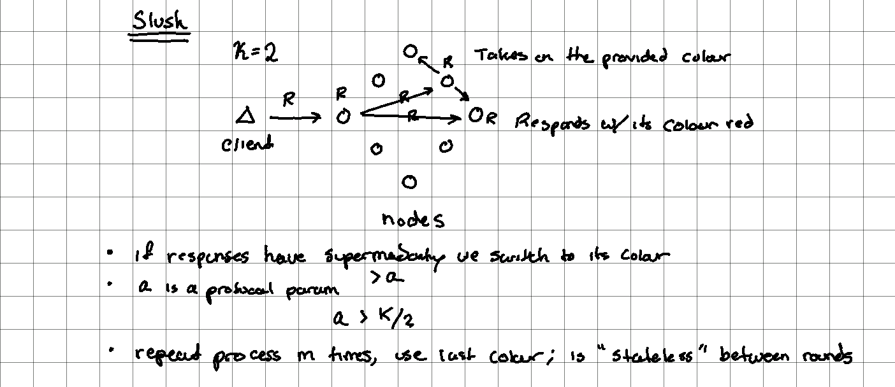
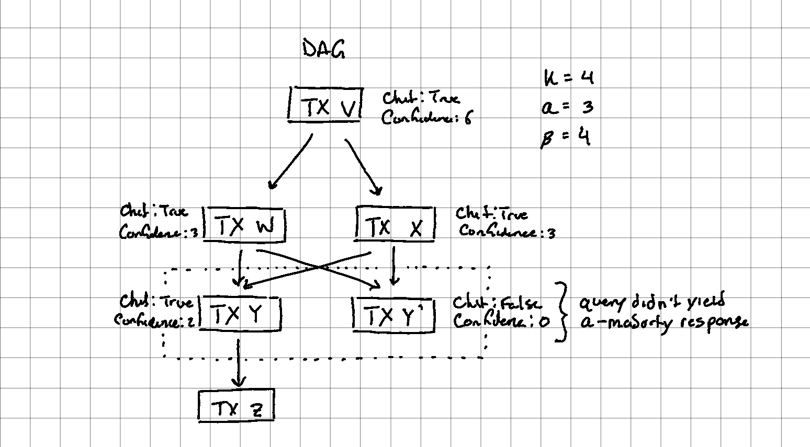

# Avalanche

Avalanche is a PoS blockchain platform that uses a custom set of consensus algorithms known as Snow*. It focuses on scalability via subnets and fast consensus and finality.

## Consensus

* Snow* family of protocols ("Slush", "Snowflake", "Snowball"); explained as increasing level of complexity but with more guarantees.
* Snowball aims to achieve the following safety and liveness guarantees,
  1. Any two honest nodes will conflict with very low probability
  2. Terminates with a positive probability within a set number of rounds
  3. If the number of byzantine nodes is ≤ `O(sqrt(n))` then termination happens with probability `≥ 1 - epsilon` and within `O(log(n))` rounds; `n` is the total number of nodes

### How It Works?

[whitepaper](https://assets.website-files.com/5d80307810123f5ffbb34d6e/6009805681b416f34dcae012_Avalanche%20Consensus%20Whitepaper.pdf)

Using an example of achieving consensus on if a user specified the colour "red" or "blue" when there are faulty nodes and byzantine nodes.

#### Slush

All nodes start off in an uncoloured state. A client sends red, (R) to an honest node. That node then is marked as R. Each node in the network executes the following loop,

  1. Send a query message to `k` (e.g. 20) randomly sampled nodes
  2. The `k` nodes receiving the query message respond in the following way depending on their state:
     1. Uncoloured: adopt the colour in the query (R) and then initiate their own query
     2. Colored: respond back with their own color (e.g. R/B)
  3. Upon collecting `k` responses a node adopts the majority colour if its fraction is greater than the preconfigured ratio (`a`, where `a ≥ k / 2`)

The execution loop is repeated for `m` rounds. The node adopts the colour chosen by the end of round `m`.

**Pros**

* Stateless: Nodes are stateless between rounds other than its current color
* Scalable: Every round involves sampling just a small, constant-sized slice of the network at random
* Robust: Makes progress under any network configuration (even fully bivalent state, i.e. 50/50 split between colors), since random perturbations in sampling will cause one color to gain a slight edge and repeated samplings afterwards will build upon and amplify that imbalance. As long as `m` is chosen high enough, all nodes will be colored identically with high probability

**Cons**

* Not _byzantine_ fault tolerant

#### Snowflake

To improve BFT, the Slush algorithm is augmented to keep a counter for the number of sequently successful queries (i.e. `≥ alpha`, otherwise the counter gets reset. With this approach there exists an irreversible state after which a decision is inevitable. Correct nodes begin to commit past the irreversible state to adopt the same color with high probability.

#### Snowball

To improve robustness an additional per-colour confidence counter is added.

1. Upon every successful query, the node increments its confidence counter for that color.
2. A node switches colors when the confidence in its current color becomes lower than the confidence value of the new color.

For maths/proofs around the safety/liveness guarantees, see section 4 of the [whitepaper](https://assets.website-files.com/5d80307810123f5ffbb34d6e/6009805681b416f34dcae012_Avalanche%20Consensus%20Whitepaper.pdf). To see a live demo of the Snowball in action, see this [visualization](https://tedyin.com/archive/snow-bft-demo/#/snow).

## Consensus for Payments

[video explanation](https://youtu.be/ZUF9sIu-D_k?t=907)

To build a payments system using the Snowball consensus, Avalanche employs an append-only DAG to tie transactions together (instead of a chain like Bitcoin uses).[^1] Appending a transaction to the DAG begins by including a set of "parents" on the DAG to attach this new tx to. Important to note, the parent transactions have nothing to do with payments, but just a place to anchor the new tx to to commit the transaction. This DAG forms our "consensus graph". The data the graph vertices store (i.e. payments) are spent UTXO (like with Bitcoin).

**Conflicts**

Transactions that spend the same outputs form a conflicting set. For each conflicting set the Snowball consensus is used to settle the conflict. Transactions that have an "alpha majority" have a boolean flag set on them called a "chit". The confidence of a node is the sum of its progeny (children) chits.

When a vertex is accepted in the conflict set, then the other vertices in the conflict set get rejected along with their disconnects. However, as long as the descendants are valid, they will get re-issued on new parents.

Acceptance/rejection are final and irreversible. Finality occurs within 1-2 seconds.

## VMs and Subnets

The Avalanche platform architecture is has two key concepts: VMs and subnets. VMs define the application-level logic (blockchain state, state transition functions, transactions, developer APIs, etc.) Every Avalanche blockchain is an instance of a VM.[^2]

Subnets are dynamic set of validators working together to achieve consensus. Each chain is validated by one subnet, but a single subnet can validate many chains. A key feature of subnets is configurable requirements imposed on validators when joining (e.g. validators must be located in a specific country, pass KYC, etc.) This is esp. useful for making regulatory/compliance manageable.

## Avalanche Platform

Avalanche has one default subnet and three chains. All validators must be part of this default subnet.

### Chains

**Platform Chain (P-Chain)**

* The metadata blockchain on Avalanche that coordinates validators and manages subnets
* Uses Snowman consensus protocol

**Contract Chain (C-Chain)**

* Creation of smart contracts
* Uses the Ethereum virtual machine (EVM)
* Uses Snowman consensus protocol (Snowball + linear DAG; see "C-Chain Deep Dive" below)

**Exchange Chain (X-Chain)**

* Uses Avalanche Consensus Protocol (Snowball + UTXO; see "Consensus for Payments" above)
* Create and exchange assets (AVAX or some real-world asset like a bond)

### Subnets

Subnets are a dynamic set of validators that validate blocks. Membership requirements can be employed within subnets (e.g. validators must be in a certain country, KYC requirements, etc.)

A validator can be a part of multiple subnets, however all validators must be part of the "Default Subnet" - a set of pre-defined blockchains (including where AVAX coin lives/traded).

## C-Chain Deep Dive

The C-Chain is EVM-compatible and has large overlap with Ethereum (as well as some ideas put forth in [[ethereum-2]]). It supports deploying EVM contracts, follows [[eip-1559]] (except even the [tip is burned](https://docs.avax.network/learn/platform-overview/transaction-fees/)), and uses random proposer selection from the P-Chain (similar to Ethereum 2's Beacon Chain selecting the block proposer using RANDAO see [[ethereum-2-pos]]).

The consensus algorithm ("Snowman") builds on Snowball, but instead of a DAG, uses a linearized chain if totally-ordered blocks.[^3] Due to this design naturally having a lot of contention (conflict sets), [Snowman++](https://twitter.com/_patrickogrady/status/1438531704595963914?lang=en) was released on [September 22](https://medium.com/avalancheavax/apricot-phase-four-snowman-and-reduced-c-chain-transaction-fees-1e1f67b42ecf) to address this problem. It works by a "soft proposer mechanism"[^4] which attempts to select a single proposer with the power to issue a block, but opens up block production to every validator if sufficient time has passed without blocks being generated.

### Snowman++

For each block a small list of validators is randomly sampled, which will act as "proposers" for the next block. Each proposer is assigned a submission window: a proposer cannot submit its block before its submission window starts (the block would be deemed invalid), but it can submit its block after its submission window expires (5 seconds), competing with next proposers. If no block is produced by the proposers in their submission windows, any validator will be free to propose a block, as happens in the ordinary Snowman protocol.

See [the spec](https://github.com/ava-labs/avalanchego/tree/v1.6.0-fuji/vms/proposervm) for a lower-level explanation and [twitter thread](https://twitter.com/_patrickogrady/status/1438531704595963914?lang=en) for a higher-level explanation.

## On MEV Extraction

Some notes on MEV extraction,

* In Snowman++ proposers get a 5 second window, but in reality it looks to be much smaller
  * Unverified "[mention](https://twitter.com/0xrelic22/status/1459242945991917569)" of 0.003 seconds to finality, which seems too low
* There appears to still be mempool according to the [C-Chain APIs](https://docs.avax.network/build/avalanchego-apis/contract-chain-c-chain-api/#methods)
* Node is written in Golang (like Geth)
* Most detail explanation on [Snowman++](https://www.youtube.com/watch?v=YDNyJei-EZg)

## Misc

* [Avalanche Native Token ($AVAX) Dynamics](https://assets.website-files.com/5d80307810123f5ffbb34d6e/6008d7bc56430d6b8792b8d1_Avalanche%20Native%20Token%20Dynamics.pdf)
  * Has notes on minting and token issuing
* [Nakamoto(Bitcoin) vs. Snow(Avalanche): consensus](https://gyuho.dev/nakamoto-bitcoin-vs-snow-avalanche-consensus.html)
  * Developer-centric explanations (which are hard to find for Avalanche unfortunately)
* [Platform Overview - Avalanche Consensus](https://docs.avax.network/learn/platform-overview/avalanche-consensus)
  * Another good explanation of the consensus protocols with graphics
* [SnowTrace](https://snowtrace.io)
  * Etherscan for Avalanche C-Chain

[^1]: [Snowball --> Avalanche](https://gyuho.dev/nakamoto-bitcoin-vs-snow-avalanche-consensus.html#snowball--avalanche)
[^2]: [Platform Overview - Virtual Machines](https://docs.avax.network/learn/platform-overview/#virtual-machines)
[^3]: [Avalanche --> Snowman](https://gyuho.dev/nakamoto-bitcoin-vs-snow-avalanche-consensus.html#avalanche--snowman)
[^4]: [Snowman++: a congestion control for Snowman VMs](https://github.com/ava-labs/avalanchego/tree/v1.6.0-fuji/vms/proposervm)

[//begin]: # "Autogenerated link references for markdown compatibility"
[byzantine-fault-tolerance]: byzantine-fault-tolerance "Byzantine Fault Tolerance"
[//end]: # "Autogenerated link references"
[//begin]: # "Autogenerated link references for markdown compatibility"
[ethereum-2]: ethereum-2 "Ethereum 2"
[eip-1559]: eip-1559 "EIP 1559"
[ethereum-2-pos]: ethereum-2-pos "Ethereum 2: Proof of Stake"
[//end]: # "Autogenerated link references"
