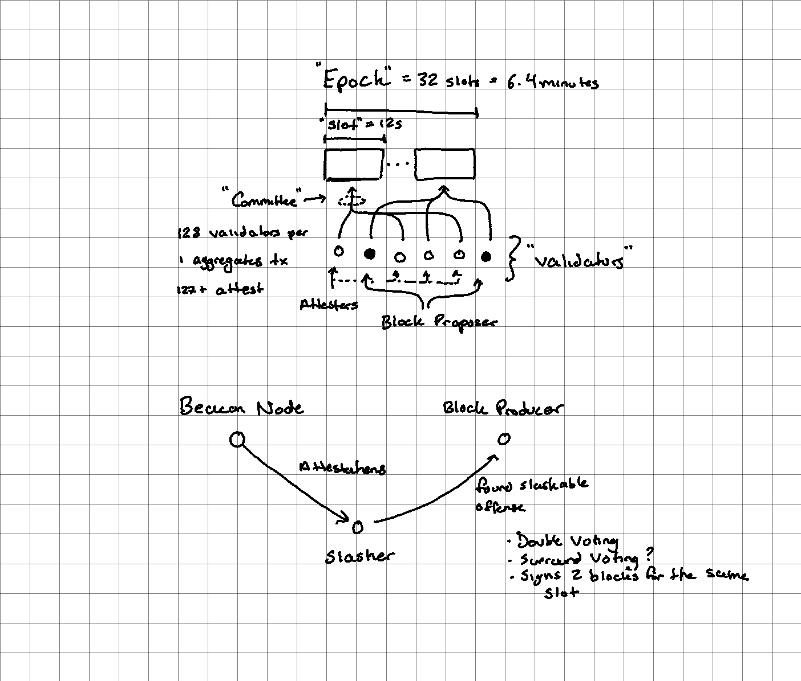

# Ethereum 2: Proof of Stake

* [The Beacon Chain Ethereum 2.0 explainer you need to read first](https://ethos.dev/beacon-chain/)
* [(Old) State of Ethereum Protocol #2: The Beacon Chain](https://media.consensys.net/state-of-ethereum-protocol-2-the-beacon-chain-c6b6a9a69129)

**Beacon Chain**

* Central chain everyone stores, downloads, and verifies
* Stores,
  * consensus-critical information (eg. who the validators are, rewards and penalties assigned to them, deposits and withdrawals)
  * pointers (hashes) to shard chain blocks and shard state

**Validators**

* Must deposit 32 ETH into an account (either via eth1 or a shard chain) to become a validator
* Validators on the beacon chain attest what they believe to be the head block
  * When sharding is available they also include a hash of the correct shard block proposed by their committee
  * When sharding is available validators are grouped up into committees ([[128, 5000] validators each](https://bisontrails.co/eth2/committee/))
* Roughly speaking, if 2/3 of active validators sign an attestation supporting a block, that block becomes finalized (not revertable)
* Validators are rewarded for correct attestations, penalized for missing or wrong attestations, and slashed for double conflicting votes
* The random selection of a validator for block proposal is via RANDAO

**Slashing**

* A slashed validator,
  1. suffers a penalty of 3-100% of their deposit
  2. is forcibly ejected from the validator set
  3. has their coins forcibly locked for an additional 4 eeks before they can withdraw

**Time**

>The Beacon Chain provides the heartbeat to Ethereum 2.0. It provides the tempo and rhythm for the system’s harmony and consensus. Each slot is 12 seconds and an epoch is 32 slots: 6.4 minutes.

~[The Beacon Chain Ethereum 2.0 explainer you need to read first](https://ethos.dev/beacon-chain/)
