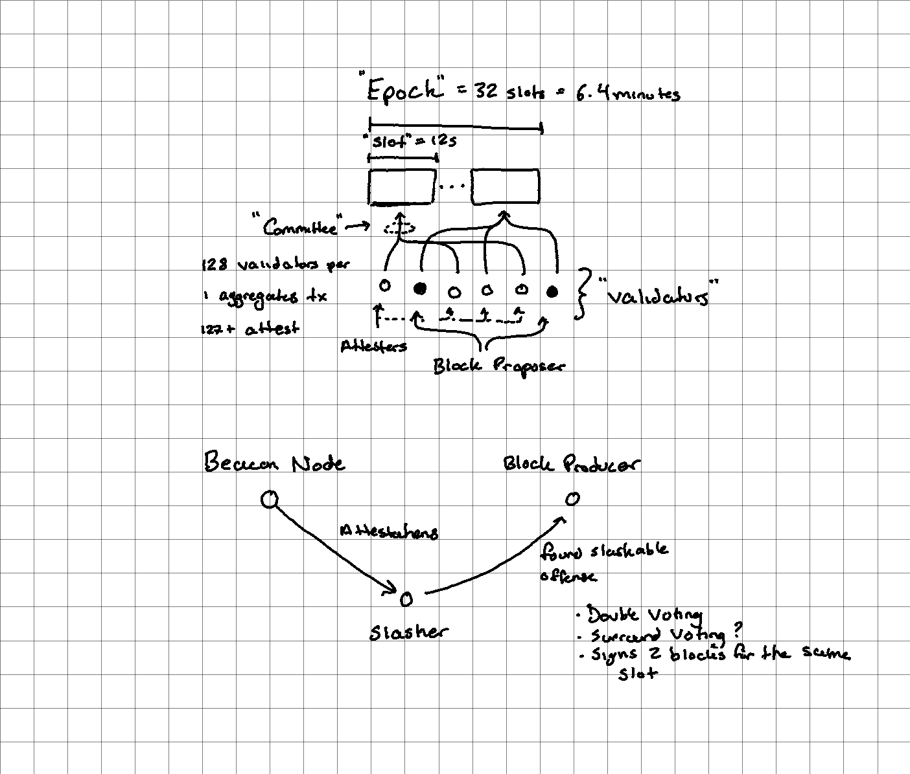

# Ethereum 2

**Resources**

* [Vitalik’s Annotated Ethereum 2.0 Spec](https://notes.ethereum.org/@vbuterin/SkeyEI3xv)
* [How The Merge Impacts Ethereum’s Application Layer](https://blog.ethereum.org/2021/11/29/how-the-merge-impacts-app-layer/)
* [Eth2 Glossary](https://kb.beaconcha.in/glossary)

### Proof of Stake

* [The Beacon Chain Ethereum 2.0 explainer you need to read first](https://ethos.dev/beacon-chain/)
* [(Old) State of Ethereum Protocol #2: The Beacon Chain](https://media.consensys.net/state-of-ethereum-protocol-2-the-beacon-chain-c6b6a9a69129)

**Beacon Chain**

* Central chain everyone stores, downloads, and verifies
* Stores,
  * consensus-critical information (eg. who the validators are, rewards and penalties assigned to them, deposits and withdrawals)
  * pointers (hashes) to shard chain blocks and shard state

**Validators**

* Must deposit 32 ETH into an account (either via eth1 or a shard chain) to become a validator
* Validators on the beacon chain attest what they believe to be the head block
  * When sharding is available they also include a hash of the correct shard block proposed by their committee
  * When sharding is available validators are grouped up into committees ([[128, 5000] validators each](https://bisontrails.co/eth2/committee/))
* Roughly speaking, if 2/3 of active validators sign an attestation supporting a block, that block becomes finalized (unrevertable)
* Validators are rewarded for correct attestations, penalized for missing or wrong attestations, and slashed for double conflicting votes
* The random selection of a validator for block proposal is via RANDAO

**Slashing**

* A slashed validator,
  1. suffers a penalty of 3-100% of their deposit
  2. is forcibly ejected from the validator set
  3. has their coins forcibly locked for an additional 4 eeks before they can withdraw

**Time**

>The Beacon Chain provides the heartbeat to Ethereum 2.0. It provides the tempo and rhythm for the system’s harmony and consensus. Each slot is 12 seconds and an epoch is 32 slots: 6.4 minutes.

~[The Beacon Chain Ethereum 2.0 explainer you need to read first](https://ethos.dev/beacon-chain/)

### Sharding

* [Roll-up Focused Sharding](https://notes.ethereum.org/@vbuterin/data_sharding_roadmap)
* [Why sharding is great: demystifying the technical properties](https://vitalik.ca/general/2021/04/07/sharding.html)
* [An explanation of the sharding + DAS proposal](https://hackmd.io/@vbuterin/sharding_proposal#An-explanation-of-the-sharding--DAS-proposal)

Sharding aims to solve the scalability trilemma (Scalability, Decentralization, Security). It works by splitting up the verification job amongst randomly selected validators that form their own committee. A validator publishes a signature attesting that they did their job, and the other validators verify this signature (e.g. via [BLS signature aggregation](https://ethresear.ch/t/pragmatic-signature-aggregation-with-bls/2105)). This way instead of 10k validators each verifying 100 blocks, they're mining a few blocks in each committee and verifying the signatures of the 10k validators.

Blocks are broadcast on subnets instead of p2p to all validators. In Big O Notation, the sharded chain's capacity is O(C^2), growing quadratically (aka quadratic sharding).

We want to have a sharding solution that avoids 51% trust assumptions for validation. Validation problem is two parts: validating computation, and validating data availability. The former relies on either [[fraud-proofs]] or [[zk-snarks]]. The data availability problem (i.e. "how do you check that 1 MB of data is available without actually trying to download it?") can be solved via [[data-availability-sampling]] which makes it feasible to run data availability checking on every block.

>In the case of Ethereum sharding, the near-term plan is to make sharded blocks data-only; that is, the shards are purely a "data availability engine", and it's the job of layer-2 rollups to use that secure data space, plus either fraud proofs or ZK-SNARKs, to implement high-throughput secure transaction processing capabilities. However, it's completely possible to create such a built-in system to add "native" high-throughput execution.

**Shard Chains**

* 64 shard chains that users post transactions to
* When a validator successfully proposes a block in a given slot it gets referenced in the beacon chain via a "crosslink" (a signature signed by the committee). Every shard block creates a [crosslink](https://notes.ethereum.org/@vbuterin/HkiULaluS)
