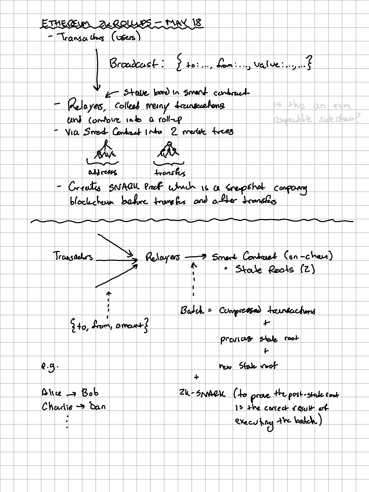
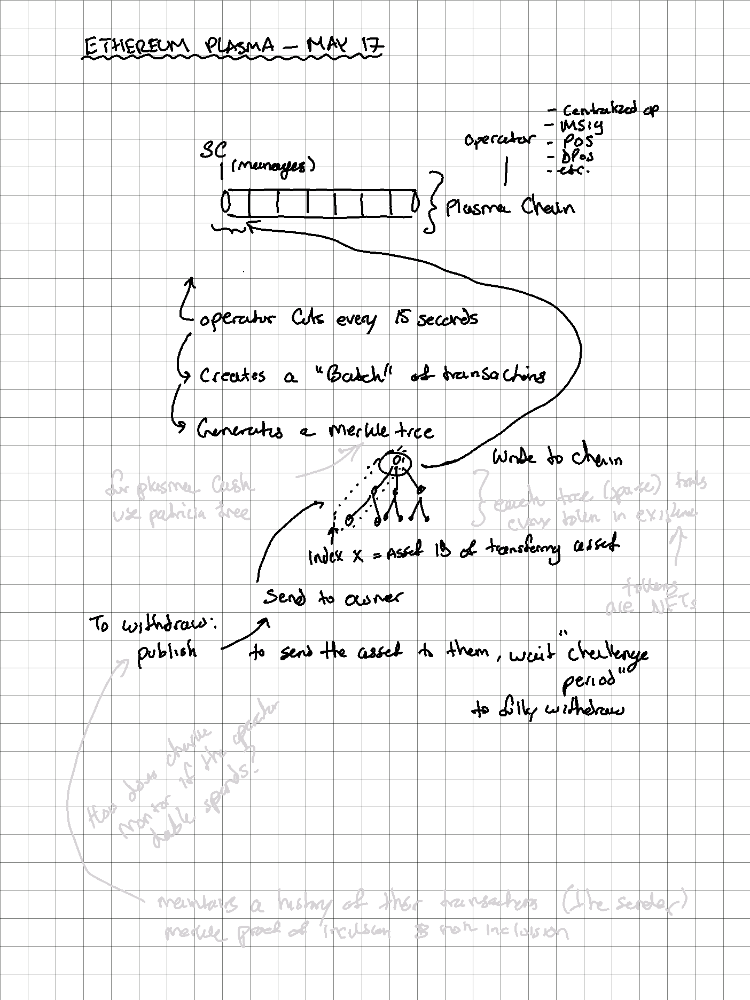

# Ethereum Scaling

## Rollups

* https://twitter.com/_jefflau/status/1394208424771035138

## Plasma

* There are many [flavours](https://ethresear.ch/t/plasma-world-map-the-hitchhiker-s-guide-to-the-plasma/4333) to Plasma (e.g. Plasma Cash, Debit, and MVP)

## State Channels

* Same principle as BTC's [[lightning-network]]
* https://github.com/raiden-network/raiden

## Sharding

* See

## Side Chains

...

[//begin]: # "Autogenerated link references for markdown compatibility"
[lightning-network]: lightning-network "Lightning"
[//end]: # "Autogenerated link references"
