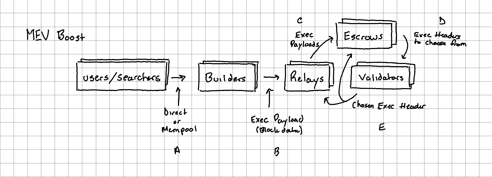

# MEV Boost

[ethreserch post](https://ethresear.ch/t/mev-boost-merge-ready-flashbots-architecture/11177) Re-architecting that supports the [[ethereum-2]] merge, but an intermediary solution to bridge the gap before the permissionless [[proposer-builder-separation]] design.

"MEV-Boost" is software that the validator runs, sitting between the consensus client and execution client.

_See [post 9](https://ethresear.ch/t/mev-boost-merge-ready-flashbots-architecture/11177/9) for a thoughtful revision to MEV boost._

## How it Works

1. Users and searchers send transactions to block builders through the public p2p txpool or through direct channels.
2. Builders construct execution payloads using these transactions as well as header parameters provided by validators. Builders may directly set the validator’s feeRecipient address as the coinbase address of the payload, or the builders may set their own address and include a transaction which transfers to the feeRecipient in the payload.
3. Relays receive execution payloads from builders and verify the validity of the payloads as well as calculate the payload value (amount of ETH paid to the feeRecipient).
4. Escrows receive the full execution payloads from relays to provide data availability.
5. Validators receive execution payload headers from relays (execution payloads stripped of the transaction content). The relay must attach an indication of the payload value to each header. The validator selects the most valuable header, signs the payload, and returns it to the relay and escrow to be propagated to the network.

## Goodbye Bundles

>This specification deprecates the use of “Flashbots Bundles” in the communication between builders and block proposers in favor of execution payloads which represent the full ordering and content of a block. While bundles have provided an efficient auction mechanism for inclusion of transaction at the top of blocks, they are not expressive enough for all order preference. In particular, bundle auctions are not well suited for large transactions or frontrunning protection use cases. Moving to full block proposals means the full range of preference on ordering can be expressed.

## Security

### Malicious Relay

Single relay, connected to 100% of validators, and lies about the payloads such that validators always select them. This could cause the chain to halt as validators are no longer proposing valid blocks.

1. invalid payload: the payload breaks some consensus rules
2. inaccurate value: the payload proposed has a different value than claimed once executed
3. missing data: the payload body was never revealed by the relay

>To mitigate this, it must be possible to either 1) pre validate payload between multiple parties ahead of sending to validators or 2) for all validators in the network to identify when a relay has proposed a bad payload and automatically fallback to a safe alternative. Critically, this security mechanism must be robust in the face of relays who are adversarial towards each other.
