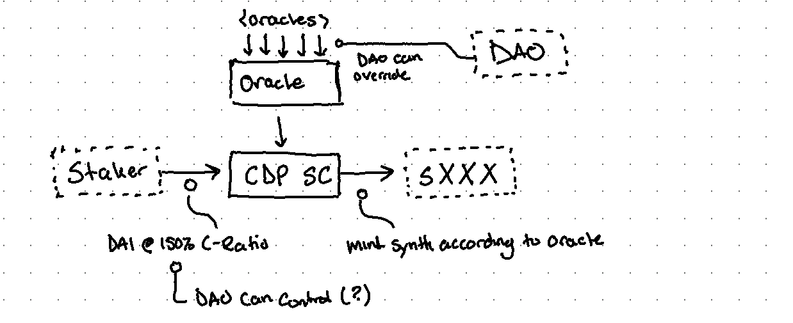
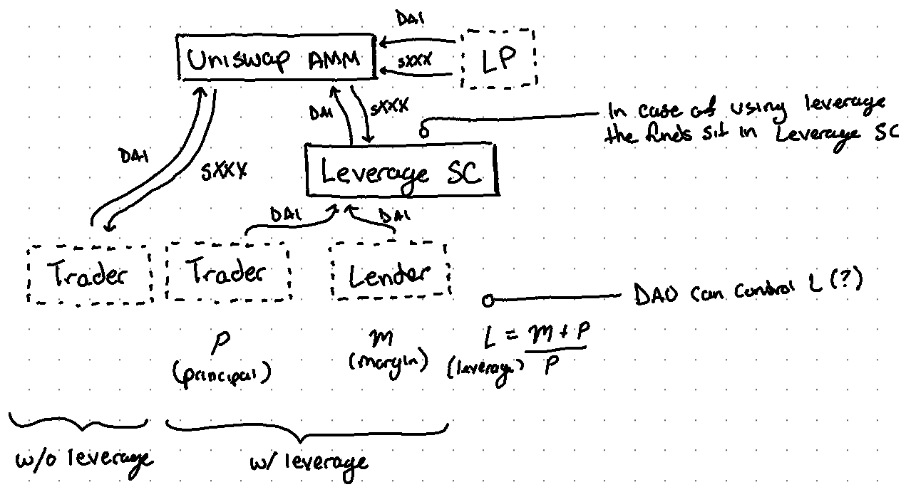

# Proposal: Synthetic Assets

## Summary

Synthetic assets are minted according to an Oracle price feed by staking [DAI](https://en.wikipedia.org/wiki/Dai_(cryptocurrency)) in a Collateralized Debt Position ([CDP](https://coincodex.com/article/5680/what-is-collateralized-debt-position/)). Staking mints a synthetic token which could be thought as a  "contractual IOU" for the asset's value. The staker would then put it up for sale (e.g. at an AMM). A staker hopes to later buy back that IOU at a lower price from someone else and burn the IOU in exchange for their original funds, making profit on the difference.

### Examples

**E.g. sTSLA goes down in price:**

Step | Alice
---|---
Alice starts off with $100,000 in DAI | `$100,000`
Alice stakes DAI, minting 200 sTSLA, and sells to AMM for $500/unit | `$100,000 --> 200 sTSLA --> $100,000`
_Some time later... sTSLA goes down 50% ($250/unit)_ | `200 sTSLA ($50,000)`
Alice buys back 200 sTSLA from AMM for $250/unit, keeping $50,000 profits | `$50,000 --> 200 sTSLA --> $100,000`

**E.g. sTSLA goes up in price:**

Step | Alice
---|---
Alice starts off with $100,000 in DAI | `$100,000`
Alice stakes DAI, minting 200 sTSLA, and sells to AMM for $500/unit | `$100,000 --> 200 sTSLA --> $100,000`
_Some time later... sTSLA goes up 100% ($1000/unit)_ | `200 sTSLA ($200,000)`
Alice buys back 200 sTSLA from AMM for $1000/unit, losing $100,000 | `$200,000 --> 200 sTSLA --> $100,000`

## Risks

* Low liquidity per market (e.g. sTSLA)
* ...

## Roles

* **Staker:** Stakers are the asset's counterparty. They create CDPs, staking DAI to mint synthetic tokens (sXXX). This is an _overcollateralized_ position according to a ratio of 150% (the _c-ratio_). Stakers must manage their position to ensure they don't get liquidated. Stakers must return the minted sXXX so as to obtain their staked DAI. Stakers hold a _short_ position on sXXX.
* **Trader:** Traders interact with AMM to buy/sell sXXX in exchange for DAI.
* **DAO Member:** A holder of the DAO token that can vote for protocol changes.
* **Liquidity Provider:** Stakes a DAI/sXXX pair in a Uniswap(-like?) exchange contract (in exchange for a fee per trade) so traders have liquidity to trade (i.e. sell DAI to buy a sXXX).
* **Keeper:** An off-chain role interacting on-chain that monitors when stakers (for CDP) are undercollateralized and would be unable to meet their debt obligations. Keepers trigger the liquidation flow.

## Liquidation

If the price of DAI causes the staker to exceed their c-ratio of 150% or (more likely) if the asset goes up in value to exceed the c-ratio then a keeper will trigger a liquidation, which has the contract put the account's staked DAI up for sale to the AMM (finding a seller of sXXX to buy the DAI). The sold sXXX is then burned.

## Incentives

* **AMM Exchange Fee:** Incentives LP to stake.
* **?Stability Fee:** Taken from stakers for issuing sXXX.
* **?Stake Reward:** Paid to stakers for issuing sXXX.
* **?Funding Rate:** Paid from shorts to long and vice versa depending on direction of the contract (contago vs backwardation). One option could be to implement this on the staked money at the AMM exchange.
* **Keeper Reward:** Paid to keeper for doing their job.

Rewards can be paid from users, buffer (where platform deposists fees), or DAO token.

## Extension: Leveraged Trades

Trading DAI for sXXX on an AMM is how one would "go long". If leverage is desired, this can be obtained by going through a "Leverage Smart Contract (SC)" where margin is obtained through a p2p Lender. The combined funds (principle, _p_ and margin, _m_) are then used to perform the trade through an AMM. The Leverage SC holds on to the funds instead of giving it to the trade or lender. This way, a keeper can trigger liquidation where the lender gets their margin back and the trader loses their principle.

