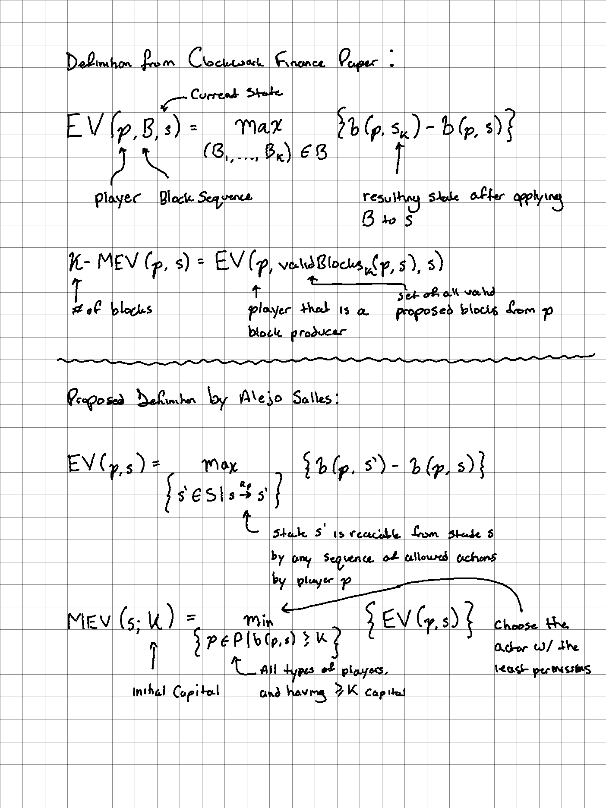

# State of MEV

**Resources**

* [MEV Roast | Scaling Ethereum Edition](https://www.youtube.com/watch?v=krlAqKsdLkw)
* [MEV on eth2](https://www.youtube.com/watch?v=zsgC6mNP9eU)
* Cross-Chain MEV ([[unity-is-strength]])
* [Clockwork Finance](https://eprint.iacr.org/2021/1147.pdf)
* [[proposer-builder-separation]]
* [MEV Smoothing](https://notes.ethereum.org/@frankdfr/ryJ7fTyeF)
* [MEV Boost](https://ethresear.ch/t/mev-boost-merge-ready-flashbots-architecture/11177)
* [Mega Bundles](https://twitter.com/bertcmiller/status/1442548307595706369)
* [EDEN Network Whitepaper](https://edennetwork.io/EDEN_Network___Whitepaper___2021_07.pdf)
* Lists
  * [github.com/awesome-MEV-resources](https://github.com/0xalpharush/awesome-MEV-resources)

### Definition

>MEV is the value that can be permissionlessly extracted by block proposers by reordering, censoring, or inserting transactions.

~[On the Formalization of MEV](https://writings.flashbots.net/research/formalization-mev/)

Notable exclusions: cost of doing MEV, probabilistic nature of it, mempool view, reverts, etc.

Non-uniform split of MEV among validators / hash-power leads to centralization and could affect the security of blockchain systems.

### MEV on [[ethereum-2]]

Eth1 blocks will be included within beacon blocks after the merge.

User sends tx
  --> tx propogated on eth1 p2p
    --> eth1 mempools
      --> eth1 client forms block
        --> block is passed to eth2 client
          --> included in beacon block

* Tx ordering on eth2 is the same on eth1 (and is done so via same eth1 client software)
* Beacon block leader selection is known 2 epochs in advance, and block times are a predictable 12s

**Distributing Rewards**

* May 2021 estimates are an increase in 71% revenue for validators
* With 100k validators, the mean # of blocks proposed per validator is 26.3; the unluckiest 1% 15 blocks a year and luckiest 1% > 39 blocks a year ~[Beacon Chain Validator Rewards](https://pintail.xyz/posts/beacon-chain-validator-rewards/)
  * MEV rewards increases this variance of returns between luckiest/unluckiest
  * Exchanges (e.g. Kraken, Binance, etc.) have the largest Eth1 deposits today which means they'll become the biggest profit earners from Eth2 MEV extraction (however, they may redirect their flow to other services like [stakefish](https://stake.fish/) to reduce risk)
  * Metapools / pool aggregators (e.g. [Lido](https://lido.fi)) redirect staking flow, may impact MEV split in a similar way to how DEX aggregators equalized prices
* MEV extraction systems will get more specialized and harder to build over time. Large pools can then hire them which creates pressure for stakers to join large pools (a greater centralization risk)

**L2s**

* Since Eth2 is roll-up centric, a lot of ordering moves to L2s so ordering on eth1 layer may matter less
* Interaction of cross-L2 ordering w/ batch ordering
* L2s may introduce their own ordering mechanics / MEV protection
  * [[optimism]] has MEV auctioning
  * Arbitrum uses "fair sequencing", a BFT layer on top and validators need to agree on the ordering (but this may move MEV to the network layer?)
  * Cryptographic Approaches(?)
    * VDFs
    * Threshold Decryption
    * SGX

**Sharded Ethereum**

* Sharding can create MEV (staggerd shards? cross-shard communication?)

**Other**

* Stateless clients (split of eth1 node runner?)
* Secret single leader election?
* Casper FFG to CBC?
* Risk: The probabilty of having contiguous slots goes up the larger you are / more centralized (multi-block MEV)

[//begin]: # "Autogenerated link references for markdown compatibility"
[unity-is-strength]: papers/unity-is-strength "Unity is Strength: A Formalization of Cross-Domain Maximal Extractable Value"
[proposer-builder-separation]: proposer-builder-separation "Proposer Builder Separation"
[ethereum-2]: ethereum-2 "Ethereum 2"
[optimism]: optimism "Optimism"
[//end]: # "Autogenerated link references"